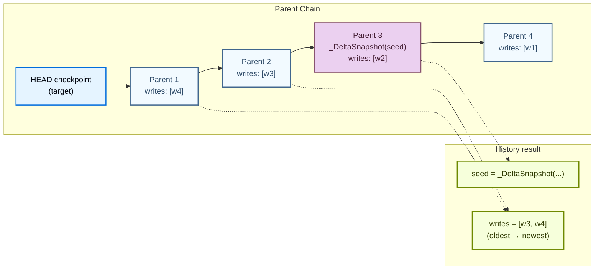

<Note>
  **Beta**—`DeltaChannel` and all APIs described here (`_DeltaSnapshot`, `get_delta_channel_history`, `get_delta_channel_keepset`, `delta_updates_since_snapshot` metadata) are in beta. The on-disk representation and method signatures may change in future releases.
</Note>

This guide is for third-party @[`BaseCheckpointSaver`] authors who need to support graphs using @[`DeltaChannel`]. It covers:

1. How `DeltaChannel` state is stored across checkpoint tables.
2. Which saver methods interact with delta channels and what the OSS implementations look like (working references you can copy).
3. How to correctly implement cleanup methods (`prune`, `delete_for_runs`, `copy_thread`) without silently corrupting delta history.

## Background

### How DeltaChannel is stored

Unlike regular channels, `DeltaChannel` does **not** write its accumulated value into every checkpoint. Instead:

- `DeltaChannel.checkpoint()` always returns `MISSING` (`libs/langgraph/langgraph/channels/delta.py`). The channel's live value is never placed in `channel_values` by default.
- A full **snapshot** (`_DeltaSnapshot(value)`) is written into `channel_values[k]` only when the channel's update count reaches `snapshot_frequency` (default 1000). This decision is made by `delta_channels_to_snapshot()` in `libs/langgraph/langgraph/pregel/_checkpoint.py`.
- Between snapshots, the channel's writes are stored as ordinary `checkpoint_writes` rows (Postgres) or `writes` rows (SQLite), keyed by `(thread_id, checkpoint_ns, checkpoint_id, task_id, idx)`.
- Reconstruction at read time walks the parent chain backward from the target checkpoint, collecting writes, until it finds an ancestor whose `channel_values[ch]` is populated (the "seed"). It then replays all collected writes through the channel's reducer on top of that seed.

#### Storage layout per backend

| Backend | Snapshot blob | Writes | Key structure |
|---------|--------------|--------|---------------|
| **Postgres** | `checkpoint_blobs` table; checkpoint JSON has `True` sentinel | `checkpoint_writes` table | `(thread_id, checkpoint_ns, channel, version)` for blobs |
| **SQLite** | Inline in checkpoint blob | `writes` table | `(thread_id, checkpoint_ns, checkpoint_id, task_id, idx)` |
| **InMemory** | `self.blobs` dict | `self.writes` dict | Same logical key structure |

#### The metadata hint

`CheckpointMetadata.delta_updates_since_snapshot` (`dict[str, int]`) tracks how many supersteps have written to each delta channel since the last snapshot. It resets to 0 when a snapshot fires. This is a **hint** for the pregel loop—the source of truth for "is there a snapshot here?" is whether `channel_values[ch]` is populated in the checkpoint.

### The reconstruction walk



The walk:

<Steps>
  <Step title="Start at the target's parent">
    Start at `target.parent_config`. The target's own `pending_writes` are excluded—they belong to the *next* super-step.
  </Step>
  <Step title="Collect writes for each ancestor">
    At each ancestor, collect `pending_writes` for the requested channels.
  </Step>
  <Step title="Stop when a seed is found">
    Stop per-channel when `channel_values[ch]` is non-empty (the seed).
  </Step>
  <Step title="Return seed and writes">
    Return `{"writes": [...], "seed": ...}` per channel. If no seed is found (the walk reaches root), `"seed"` is omitted and the consumer treats this as "start empty."
  </Step>
</Steps>

**Default implementation:** `BaseCheckpointSaver.aget_delta_channel_history` at `libs/checkpoint/langgraph/checkpoint/base/__init__.py`—one `aget_tuple` call per ancestor. Correct but O(chain_length) round-trips.

## Read and write surface

These are the saver methods that interact with `DeltaChannel`. The base class provides correct defaults; overrides exist only as performance optimizations.

### `aput`—accept `_DeltaSnapshot` in `channel_values`

Snapshot blobs reach `aput` as `_DeltaSnapshot(value)` instances inside `checkpoint["channel_values"]`. Round-tripping them through `JsonPlusSerializer` is sufficient (msgpack ext code `EXT_DELTA_SNAPSHOT`). No special-casing is required for correctness.

<Tip>
  **Optimization (Postgres):** hoist non-primitive values into a side blob table (`checkpoint_blobs`) and replace the JSON value with `True`.
</Tip>

**References:**

- @[`InMemorySaver`]`.put`—simplest, at `libs/checkpoint/langgraph/checkpoint/memory/__init__.py`
- @[`PostgresSaver`]`.put`—sentinel + side-blob, at `libs/checkpoint-postgres/langgraph/checkpoint/postgres/__init__.py`
- @[`SqliteSaver`]`.put`—inline, at `libs/checkpoint-sqlite/langgraph/checkpoint/sqlite/__init__.py`

### `aput_writes`—append pending writes

One row per `(channel, idx)` keyed by `(thread_id, checkpoint_ns, checkpoint_id, task_id, idx)`. No `DeltaChannel`-specific logic needed—these rows are what the parent-chain walk reads.

### `aget_tuple` and `alist`—join writes

Must return `pending_writes` populated (oldest-first per task) so the default `aget_delta_channel_history` walk can collect them from each ancestor.

### `aget_delta_channel_history`—performance optimization

The base implementation works out of the box but does one `aget_tuple` per ancestor. For long chains (up to `snapshot_frequency` = 1000 steps), this becomes expensive. Override for performance.

**Working references** (progressively richer):

| Backend | Approach | Reference |
|---------|----------|-----------|
| **InMemory** | Walks dict keys directly | `libs/checkpoint/langgraph/checkpoint/memory/__init__.py` |
| **SQLite** | Paged DESC scan + per-channel UNION ALL writes fetch | `libs/checkpoint-sqlite/langgraph/checkpoint/sqlite/_delta.py` and `libs/checkpoint-sqlite/langgraph/checkpoint/sqlite/__init__.py` |
| **Postgres** | JSONB-aware two-stage SQL (stage 1: paged `checkpoint_id` DESC with parallel `channel_values->key IS NOT NULL` checks; stage 2: per-channel UNION ALL writes + seed blob fetch) | `libs/checkpoint-postgres/langgraph/checkpoint/postgres/base.py` and `libs/checkpoint-postgres/langgraph/checkpoint/postgres/__init__.py` |

### `adelete_thread`—safe cleanup

Wholesale delete of all rows for a `thread_id`. No `DeltaChannel` risk because nothing survives. Copy the pattern from any OSS saver.

## Cleanup surface

These optional methods (`prune`, `delete_for_runs`, `copy_thread`) have **no OSS implementation** yet. The docstrings on `BaseCheckpointSaver` flag the danger; this section provides concrete recipes.

### The challenge

<Warning>
  Naive cleanup that drops intermediate ancestors causes **silent data loss**—reconstruction returns an empty value with no exception raised.
</Warning>

- The "latest" checkpoint is rarely a snapshot point (`snapshot_frequency` defaults to 1000).
- A naive `keep_latest` that drops intermediate ancestors and their `checkpoint_writes` severs the parent chain.
- The surviving head's reconstruction walk hits `parent_config = None` early, finds no seed, and `from_checkpoint(MISSING)` produces an empty value.
- The same trap applies to `delete_for_runs` (a run's writes may be ancestors of a live head) and `copy_thread` (head-only copy strands the target).

### The `get_delta_channel_keepset` helper

`BaseCheckpointSaver` provides a helper that returns the minimum set of `checkpoint_id`s that must survive deletion:

```python
keep = await saver.aget_delta_channel_keepset(
    config=head_config, channels=["messages", "events"],
)
# `keep` contains the head + every ancestor back to the nearest
# _DeltaSnapshot for each listed channel. Delete everything else.
```

Pass `channels=[]` for graphs without `DeltaChannel`—returns `{head_id}` only.

### Implement `prune`

There are three strategies, ordered from most space-efficient to simplest:

<Tabs>
  <Tab title="Strategy A: Compact-and-prune">
    Most space-efficient, but **requires graph access** (channel reducers must be available, so this runs at the application layer, not purely saver-side).

    <Steps>
      <Step title="Resolve current value">
        Resolve the current value via `saver.aget_delta_channel_history(config=head, channels=delta_channels)`.
      </Step>
      <Step title="Fold writes through reducers">
        Fold writes through each channel's `reducer` to get the live value.
      </Step>
      <Step title="Rewrite as snapshot">
        Rewrite `channel_values[ch] = _DeltaSnapshot(value)` on the kept head (update the checkpoint row + blob table).
      </Step>
      <Step title="Delete everything else">
        Now `aget_delta_channel_keepset(channels=[])` returns `{head_id}`—delete everything else.
      </Step>
    </Steps>
  </Tab>
  <Tab title="Strategy B: Walk-to-boundary">
    No rewrite needed. Preserves more rows than Strategy A but is correct and simple.

    ```python
    async def aprune(self, thread_ids, *, strategy="keep_latest"):
        for tid in thread_ids:
            heads = await self._list_heads(tid)         # your backend code
            keep: set[str] = set()
            for h in heads:
                keep |= await self.aget_delta_channel_keepset(
                    config=h, channels=DELTA_CHANNELS,
                )
            all_ids = await self._list_all_ids(tid)     # your backend code
            to_delete = all_ids - keep
            await self._delete_checkpoint_rows(tid, to_delete)
            await self._delete_writes(tid, to_delete)
    ```
  </Tab>
  <Tab title="Postgres SQL sketch">
    Pure SQL recursive CTE alternative to the Python helper:

    ```sql
    WITH RECURSIVE ancestors AS (
        SELECT checkpoint_id, parent_checkpoint_id,
               (checkpoint -> 'channel_values' -> 'messages') IS NOT NULL AS has_snap
        FROM checkpoints
        WHERE thread_id = $1 AND checkpoint_ns = $2 AND checkpoint_id = $3

        UNION ALL

        SELECT c.checkpoint_id, c.parent_checkpoint_id,
               (c.checkpoint -> 'channel_values' -> 'messages') IS NOT NULL
        FROM checkpoints c
        JOIN ancestors a ON c.checkpoint_id = a.parent_checkpoint_id
        WHERE NOT a.has_snap
    )
    SELECT checkpoint_id FROM ancestors;
    -- This returns the keep-set for channel 'messages'.
    ```
  </Tab>
</Tabs>

### Implement `copy_thread`

**Default safe approach:** copy *all* rows for `(source_thread_id, *)` to `(target_thread_id, *)` across all three tables. Single transaction, simple `INSERT ... SELECT`. No `DeltaChannel`-specific logic needed—the full chain is preserved.

<Accordion title="Postgres example">

```sql
INSERT INTO checkpoints (thread_id, checkpoint_ns, checkpoint_id, ...)
SELECT $target, checkpoint_ns, checkpoint_id, ...
FROM checkpoints WHERE thread_id = $source;

INSERT INTO checkpoint_blobs (thread_id, checkpoint_ns, channel, version, ...)
SELECT $target, checkpoint_ns, channel, version, ...
FROM checkpoint_blobs WHERE thread_id = $source;

INSERT INTO checkpoint_writes (thread_id, checkpoint_ns, checkpoint_id, ...)
SELECT $target, checkpoint_ns, checkpoint_id, ...
FROM checkpoint_writes WHERE thread_id = $source;
```

</Accordion>

<Tip>
  If you must copy only a sub-range, apply Strategy A (compact a snapshot onto the chosen head first) then copy that single checkpoint.
</Tip>

### Implement `delete_for_runs`

`run_id` lives in `metadata` JSON, not as a column. Implementations need a JSON predicate:

```sql Postgres
SELECT checkpoint_id FROM checkpoints
WHERE thread_id = $1 AND metadata->>'run_id' = ANY($2);
```

<Warning>
  Deleting a run's checkpoints/writes can strand surviving heads in the same thread whose reconstruction walk would have traversed those rows.
</Warning>

Recipe:

<Steps>
  <Step title="Identify rows belonging to the run">
    Identify all `(thread_id, checkpoint_id)` belonging to the run.
  </Step>
  <Step title="Compute keep-sets for live heads">
    For every still-live head in those threads, compute the keep-set:

    ```python
    keep |= await saver.aget_delta_channel_keepset(config=head, channels=...)
    ```
  </Step>
  <Step title="Delete only outside the keep-set">
    Only delete run rows that fall **outside** the union of all keep-sets.
  </Step>
  <Step title="Preserve overlap rows">
    If a row is both "belongs to run" and "in keep-set," it must survive.
  </Step>
</Steps>

## Validate your implementation

### Conformance suite

Run the existing conformance tests for any methods you implement:

```python
from langgraph.checkpoint.conformance import validate

report = await validate(my_checkpointer, capabilities={
    "delta_channel_history",
    "delta_channel_keepset",
    "delta_channel_reconstruction",
})
report.print_report()
assert report.passed_all_base()
```

The three delta capabilities test:

| Capability | What it verifies |
|------------|-------------------|
| `delta_channel_history` | Walk contract (writes oldest→newest, seed is nearest populated `channel_values[ch]`, target's writes excluded). |
| `delta_channel_keepset` | Keep-set contract (empty channels → `{target}`, snapshot N-back → full chain, multi-channel → union). |
| `delta_channel_reconstruction` | End-to-end round-trip: write `_DeltaSnapshot` + writes via `aput` / `aput_writes`, read via `aget_delta_channel_history`, reconstruct via `DeltaChannel.from_checkpoint(seed) + replay_writes(writes)`, assert value equality. |

### Recommended additional test

Build a graph with `DeltaChannel(snapshot_frequency=10)`, drive it for ~25 supersteps, run your `prune` / `delete_for_runs` / `copy_thread`, then assert the reconstructed value equals the pre-cleanup value. This is the single test that catches the silent-corruption mode (conformance alone is necessary but not sufficient for cleanup methods).

See existing patterns in:

- `libs/langgraph/tests/test_delta_channel_migration.py`
- `libs/langgraph/tests/test_delta_channel_exit_mode.py`

## References

- Docstring warnings on `BaseCheckpointSaver`: `prune`, `aprune`, `delete_for_runs`, `adelete_for_runs`, `copy_thread`, `acopy_thread` (`libs/checkpoint/langgraph/checkpoint/base/__init__.py`).
- `DeltaChannel` Beta warning (`libs/langgraph/langgraph/channels/delta.py`).
- Conformance suite (`libs/checkpoint-conformance/langgraph/checkpoint/conformance/`).
